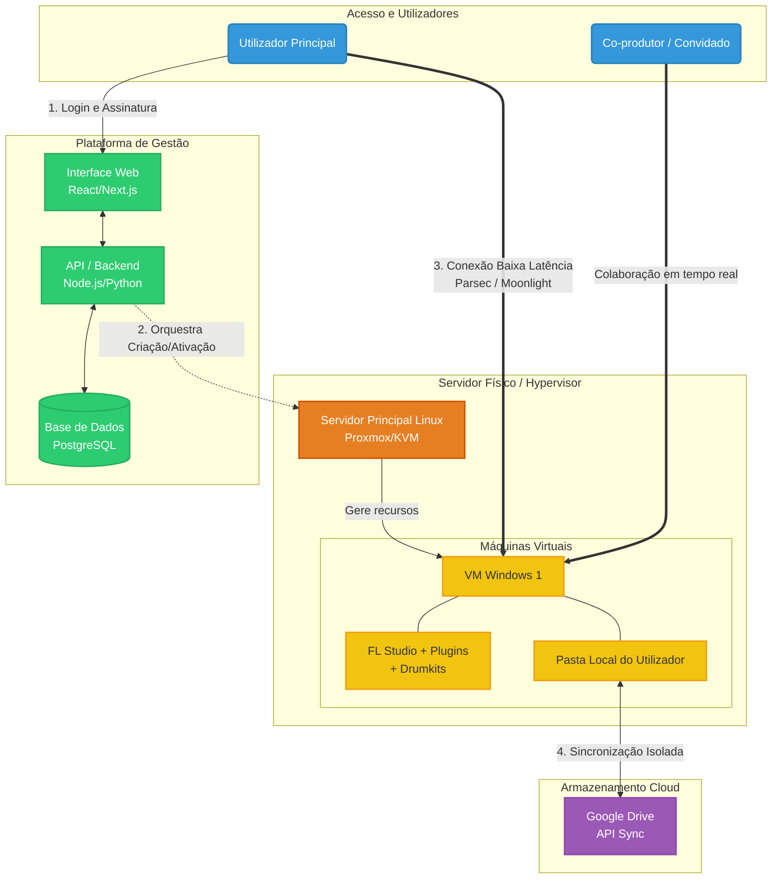

```mermaid
graph TD
    %% Estilos
    classDef client fill:#3498db,stroke:#2980b9,stroke-width:2px,color:#fff;
    classDef web fill:#2ecc71,stroke:#27ae60,stroke-width:2px,color:#fff;
    classDef infra fill:#e67e22,stroke:#d35400,stroke-width:2px,color:#fff;
    classDef vm fill:#f1c40f,stroke:#f39c12,stroke-width:2px,color:#333;
    classDef cloud fill:#9b59b6,stroke:#8e44ad,stroke-width:2px,color:#fff;

    subgraph Acessos [Acesso e Utilizadores]
        U1(Utilizador Principal):::client
        U2(Co-produtor / Convidado):::client
    end

    subgraph Portal [Plataforma de Gestão]
        UI[Interface Web <br> React/Next.js]:::web
        API[API / Backend <br> Node.js/Python]:::web
        DB[(Base de Dados <br> PostgreSQL)]:::web
    end

    subgraph Servidor [Servidor Físico / Hypervisor]
        Linux[Servidor Principal Linux <br> Proxmox/KVM]:::infra
        
        subgraph VMs [Máquinas Virtuais]
            VM1[VM Windows 1]:::vm
            FL1[FL Studio + Plugins <br> + Drumkits]:::vm
            Pasta1[Pasta Local do Utilizador]:::vm
            
            VM1 --- FL1
            VM1 --- Pasta1
        end
    end

    subgraph Storage [Armazenamento Cloud]
        GDrive[Google Drive <br> API Sync]:::cloud
    end

    %% Relações e Fluxos
    U1 -->|1. Login e Assinatura| UI
    UI <--> API
    API <--> DB
    API -.->|2. Orquestra Criação/Ativação| Linux
    
    Linux -->|Gere recursos| VM1
    
    U1 == 3. Conexão Baixa Latência <br> Parsec / Moonlight ==> VM1
    U2 == Colaboração em tempo real ==> VM1
    
    Pasta1 <-->|4. Sincronização Isolada| GDrive
```